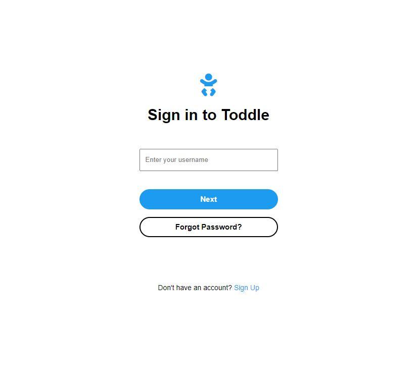
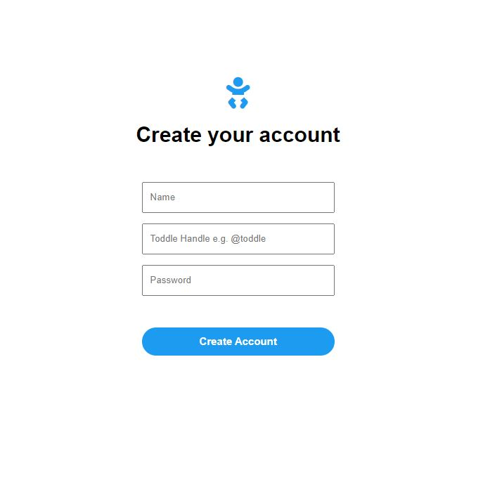
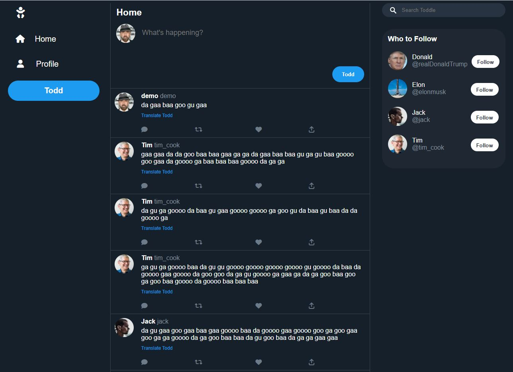
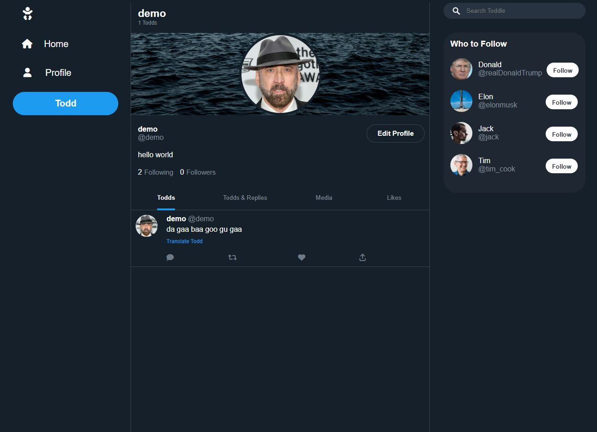
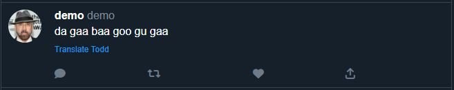
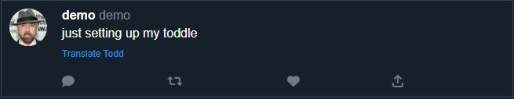

# Toddle - Twitter for Toddlers
A (crappy) Twitter clone built with JavaScript, Express.js, PostgresSQL, various Express middleware and third party modules.

## Live Demo:

# Features
- Login page with authorization flow
- Sign-up page for new users
- Custom Toddle handle (e.g. @Ken), bio and profile picture
- Following other users
- Viewing Todds posted by followed users on home feed
- Remembers if user has previously logged in, and keeps session
- Keeps track of Todds posted, following count and follower count
- Posting a Tweet (known as Todd)
- Todds are automatically converted to baby speak, with a "Translate Todd" button to translate baby speak back to normal text. Translation is toggleable.

# Screenshot

### Login page:

### Sign-up page:

### Home page:

### Profile page:

### Baby Speak Translator - Before:

### Baby Speak Translator - After:

# To be Implemented
- Functionality for liking, commenting/replying, re-Todding
- Pop-up menu for logging out and deleting Todds
- Allow for image to be posted
- Custom header image
- View all liked Todds
- Indicate whether a user follows you
- Dynamically changing "Who to follow" section
- Usable search bar

# Approach Taken

## Managing Scope
  - With the alloted time being only 2 days to complete the project, the scope of this project was severely managed and limited, with major intended features not included (such as liking, re-Todding, commenting)
  - With that in mind, the scope of the project is as follows:
    - Login page
    - Sign up page
    - Home feed displaying Todds posted by user and other users followed by user
    - View user's own profile and other users' profiles

## Referencing Twitter
With this being a (crappy) Twitter clone, there is no surprise that referencing Twitter is the first step

By looking at a Twitter profile, the following was identified as necessary data to be stored in the database in order for a profile to be rendered:
  - Twitter name
  - Tweet count
  - Header image
  - Profile picture
  - Twitter handle
  - Biography
  - Following/Followed button (determined by whether user is following the other user or not)
  - Follower/Following count
  - Tweets posted by user

By looking at a Tweet, the following was identified as necessary data to be stored in the database in order to render a Tweet on the home feed:
  - Twitter name
  - Twitter handle
  - Profile picture
  - Tweet content

## Managing Follower/Followee Relationship
- It is critical to this project to manage the follower (**the user following**)/followee (**the user being followed**) relationship between users for the following reasons:
  - To display relevant Todds for users (only Todds posted by user and other users followed by user is displayed)
  - To display the appropriate Following/Follow button when visiting other users' profile

- In order to manage this many-to-many relationship, a table with two columns is created: one column with the follower's user ID (followeeId) and the other column with the followee's user ID (followeeId).
- For example, if user with userID: 1 follows another user with userID:2, the table would look as such:

| followeeId | followerId |
| -----------|------------|
| 1          | 2          |

- user with userId:1 follows another user with userId: 3 and userId: 4:

| followeeId | followerId |
| -----------|------------|
| 1          | 2          |
| 1          | 3          |
| 1          | 4          |

### Displaying Relevant Todds
- With the above table, it is just a matter of joining the `user` table, the `todds` table and the `follower/followee` table and selecting the relevant data filtered by `followeeId = {user's ID}`

### Displaying appropriate Following/Follow button
- With the above table, we can extract a list of users followed by the user into an array
- When visiting a certain user, the user's user ID is checked against the array - if the array includes the user's user ID, then the user is followed