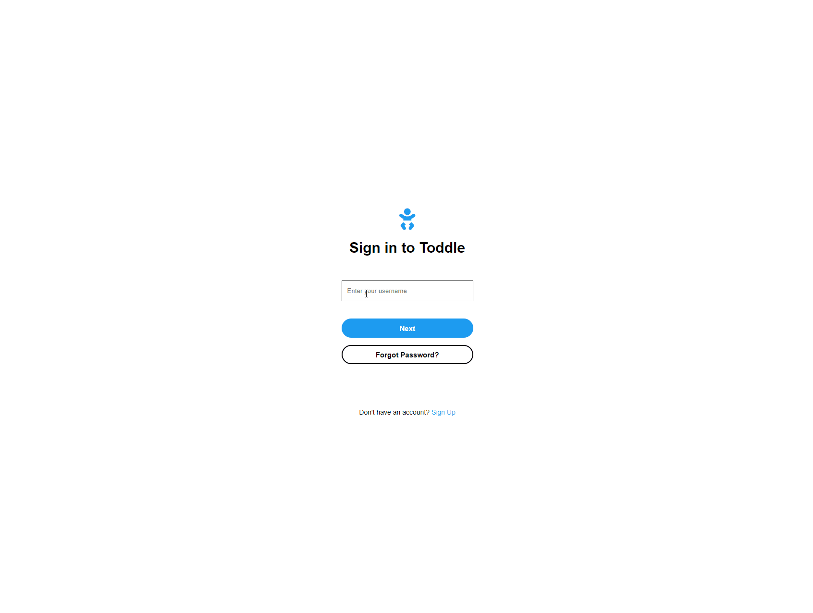
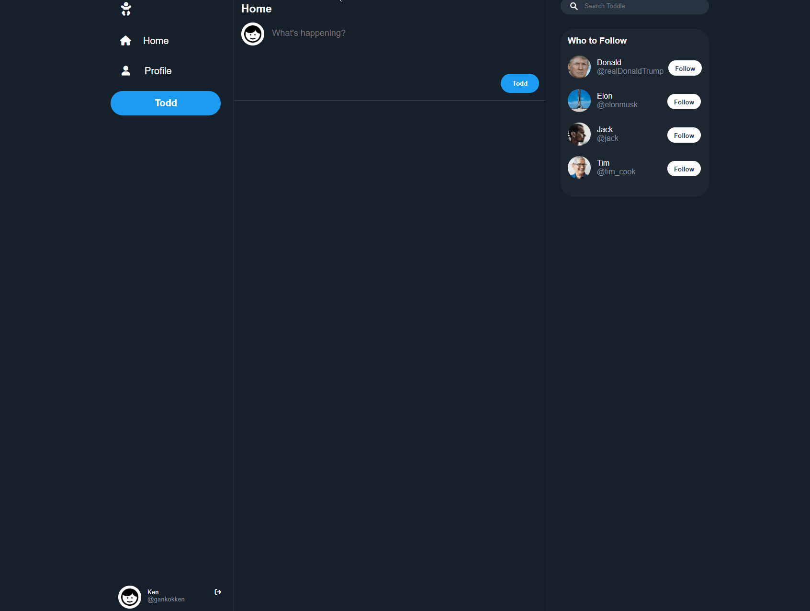
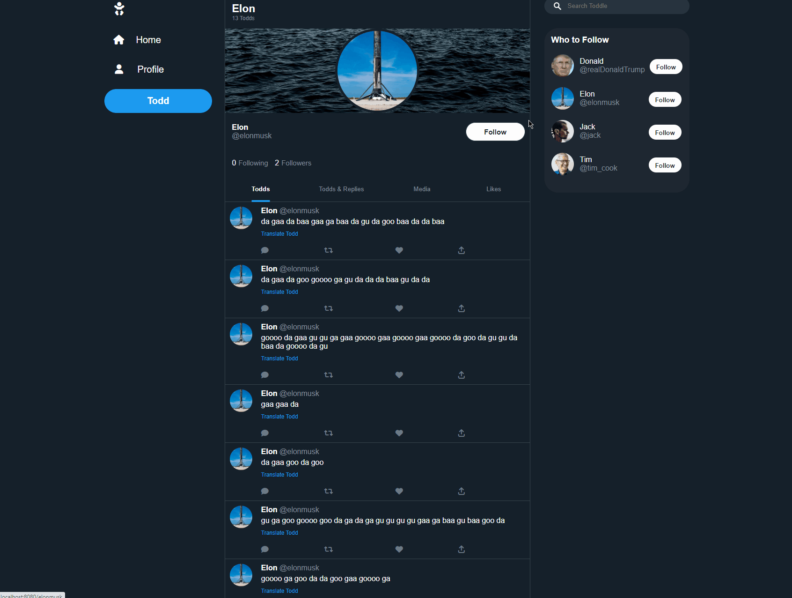
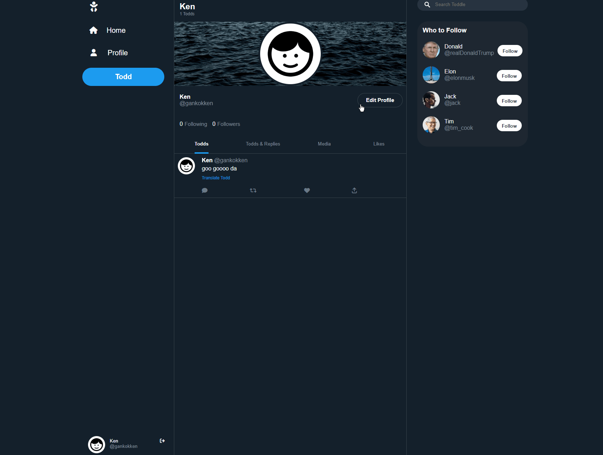

# Toddle - Twitter for Toddlers

A simplified Twitter clone where a Todd (Tweet equivalent) will be posted in babyspeak!

# Features and Demo

### 1. Sign-up page for new users and login page with authorization flow

### 2. Post Todds which are automatically converted to baby speak, with a toggleable translation to translate baby speak back to normal text

### 3. Following and unfollow other users and viewing Todds posted by followed users on home feed

### 4. Edit user profile

# Built With

- [Express.js](https://expressjs.com/) - Backend framework
- [Express EJS Layout](https://github.com/Soarez/express-ejs-layouts) - Layout support for ejs in Express
- [Express Session](https://github.com/expressjs/session) - Session middleware
- [Method Override](https://github.com/expressjs/method-override) - Enables the use of PUT/DELETE
- [node-postgres](https://github.com/brianc/node-postgres) - PostgreSQL client for Node.js
- [bcrypt.js](https://github.com/kelektiv/node.bcrypt.js) - Library for hashing passwords

# Some Implementation Detail

## Managing Follower/Followee Relationship

- It is critical to this project to manage the follower (**the user who is following**)/followee (**the user being followed**) relationship between users for the following reasons:

  - To display relevant Todds for users (only Todds posted by user and other users followed by user is displayed)
  - To display the appropriate Following/Follow button when visiting other users' profile

- In order to manage this many-to-many relationship, a table with two columns is created: one column with the follower's user ID (followeeId) and the other column with the followee's user ID (followeeId).
- For example, if user with userID: 1 follows another user with userID:2, the table would look as such:

  | followeeId | followerId |
  | ---------- | ---------- |
  | 1          | 2          |

- user with userId:1 follows another user with userId: 3 and userId: 4:

  | followeeId | followerId |
  | ---------- | ---------- |
  | 1          | 2          |
  | 1          | 3          |
  | 1          | 4          |

### Displaying Relevant Todds

- With the above table, it is just a matter of joining the `user` table, the `todds` table and the `follower/followee` table and selecting the relevant data filtered by `followeeId = {user's ID}`

### Displaying appropriate Following/Follow button

- With the above table, we can extract a list of users followed by the user into an array
- When visiting a certain user, the user's user ID is checked against the array - if the array includes the user's user ID, then the user is followed

# To be Implemented

- Functionality for liking, commenting/replying, retodding (Retweet equivalent)
- Pop-up menu for logging out and deleting Todds
- Allow for image to be posted
- Custom header image
- View all liked Todds
- Indicate whether a user follows you
- Usable search bar
